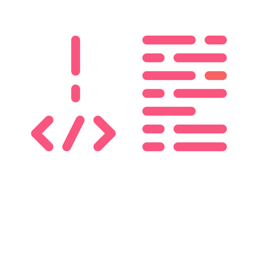

# Welcome to my portfolio 

### In this project/showcase you get a deeper insigt about myself

| Languages     | level    | 
| ------------- |:-------------:| 
| HTML5         | High          | 
| CSS3          | High          |   
| Javascript    | Intermediate  |  

There are 4 main sections to the website: 

1. Portfolio
2. Datamatiker (Computer Science AP)
3. Multimediedesign (Multimediadesigner)
4. Om mig (About me)

**Portfolio:** You will get an insigt in what types of projects i have made, both my personal project aswell as school projects.

**Datamatiker:** In this section, my time in Computer Science will be described.

**Multimediedesign:** I went to multimediadesign for 2 semesters and it will be described what i went throught with projects and what i learned. 

**Om mig:** In the final section/main section you will learn much more about me. My history, my competences and my visions and ambitions for the future. 

If you want to know more og get in touch with me, you can contact me on: 

Khizer759@gmail.com

